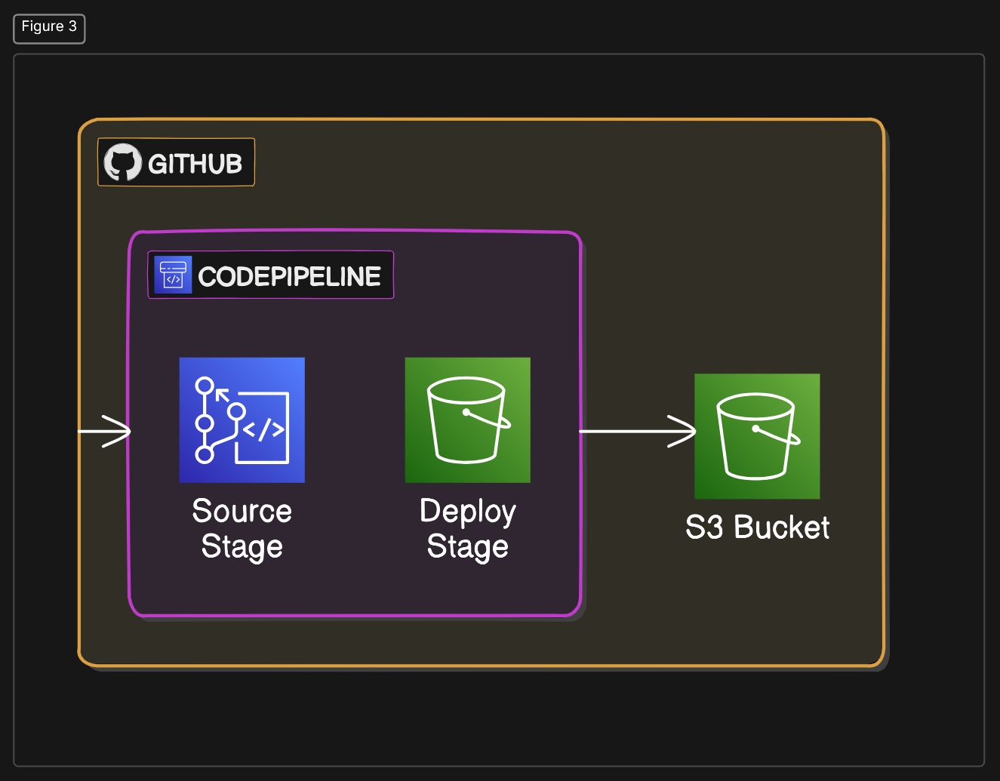

Meme Card Game

Project Overview

This project is a simple card game using memes. The game is built using HTML, 
JavaScript, and CSS. The code is hosted on GitHub, and the deployment is managed 
through AWS services, including S3 for static website hosting and Code Pipeline for 
continuous deployment.

Features
 Meme Card Game: Flip the cards to find matching pairs of memes.
Responsive Design: The game is playable on various device sizes.
Continuous Deployment: Automated deployment pipeline using GitHub, S3, 
and Code Pipeline.

Requirements
 AWS Account
GitHub Account
Basic knowledge of HTML, CSS, and JavaScript

Setup and Deployment
 Set up your CSS, HTML, Java Script code in a Git repo
 Choose two images of your choice for each pair.
Create and Configure S3 Bucket
1. Log in to your AWS Management Console.
2. Navigate to the S3 service.
3. Click "Create bucket" and configure the following:
Bucket Name: A unique name for your bucket.
Region: Select a region close to you.
Bucket Settings for Block Public Access: Uncheck "Block all public access" 
and acknowledge the warning.

5. After creating the bucket, go to the "Properties" tab and enable "Static website 
hosting".
Index Document: index.html
Error Document: index.html
6. Add a basic bucket policy in permission as below:

Set Up Code Pipeline:

1. Navigate to the Code Pipeline service in the AWS Management Console.
2. Click "Create pipeline".
3. Configure the pipeline:
Pipeline Settings: Name your pipeline.
Source Stage: Select GitHub, connect your GitHub account, and choose the 
repository and branch.
Build Stage: Skip the build stage (not required for static websites).
Deploy Stage: Choose "Amazon S3" and select the bucket you created 
earlier.
4. Review and create the pipeline.

   
 Test the Deployment
1. Make a change to your repository on GitHub (e.g., update the README or modify a 
file).
2. Push the changes to GitHub.
3. Code Pipeline will automatically trigger and deploy the changes to the S3 bucket.
4. Access your game using the S3 bucket endpoint URL

