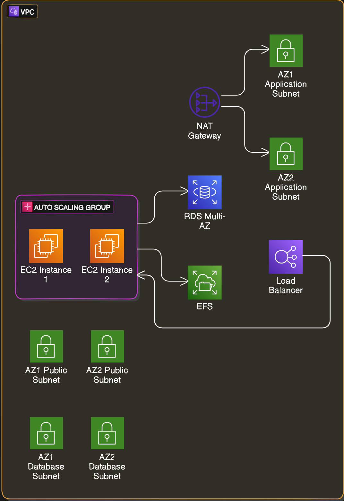
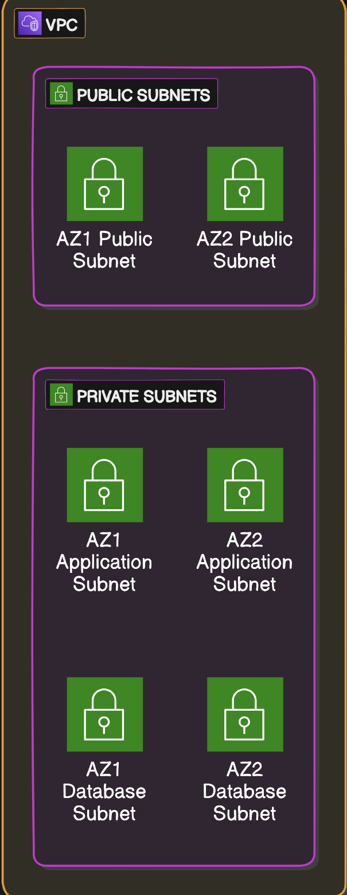
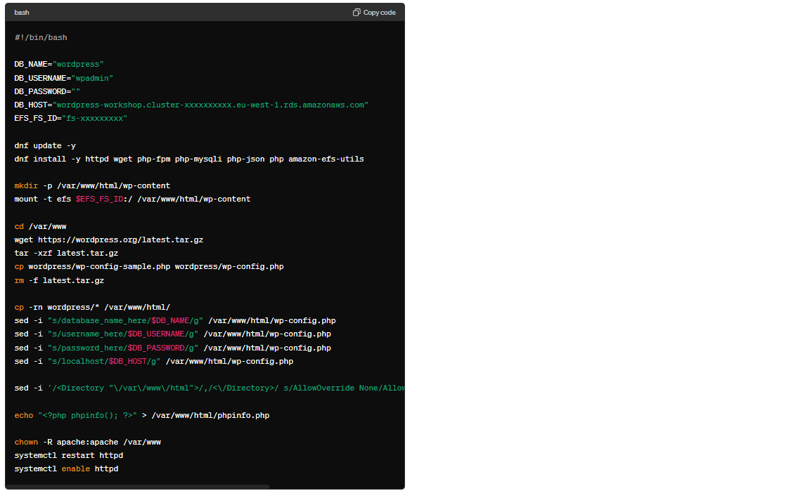
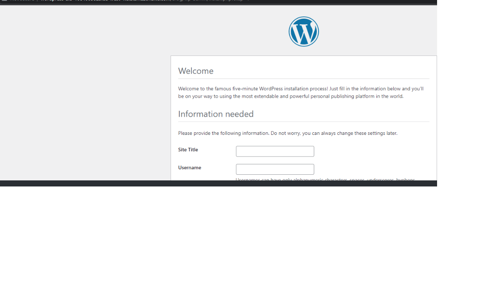

WordPress High Availability Deployment Project

Overview
Web applications typically need to scale continuously in response to the varying rate of requests they receive and to achieve the availability levels required. To reach its availability targets, an application might need to run out of multiple locations and continue to function as components, servers, or even locations fail.
In this project, I have created a highly available, scalable deployment of the WordPress web application. I have deployed a WordPress application in such a way that the application server, database, and file server tiers can scale independently of one another. I will also deploy the application's components into two availability zones to protect it against failure of any one availability zone. 

Architecture Diagram

Steps to follow

⦁	Create a VPC

⦁	Subnets are essential for organizing and segmenting resources within a VPC. In this project, we will create both public and private subnets across multiple Availability Zones (AZs) to host various components of the application.
⦁	The Public subnets will be accessible from the internet and will host load balancers and NAT gateways. The Application subnets will contain application servers and a shared EFS filesystem. These servers will have limited internet access via NAT gateways and will communicate only with the load balancers. 
The Database subnets will host the relational database and will not have internet access but will be reachable by resources within the VPC.

 
 
⦁	We have successfully established a Virtual Private Cloud Network spanning between two availability zones. Within this Network, six subnets have been created, evenly distributed across the availability zones, with three in each.
⦁	Resource map section in VPC, shows your VPC, Route tables, subnets, Internet gateways, which will help us visualize the resources.

⦁	Building the Data Tier

Now that we have created a VPC, across multiple availability zones, we will create a resilient, high available data tier designed to support our WordPress Installation.

Set up a RDS Database:

Create database security groups:
⦁	WP Database Clients for EC2 instances hosting web servers.
⦁	WP Database for the RDS DB instance.
⦁	Visit the Amazon VPC console and create 2 security groups:
⦁	Create a name for WP Database Clients security group:
⦁	Click on "Create security group."
⦁	Fill in name and description.
⦁	Choose the appropriate VPC.
⦁	Click "Create security group."
Create a name for WP Database security group:
⦁	Click on "Add rule" in the Inbound Rules section.
⦁	Select Type MySQL/Aurora to allow traffic on port 3306 from Custom source WP Database Clients security group.
Create an RDS subnet group:
⦁	Visit the Amazon RDS console.
⦁	Click on "Subnet groups" in the left panel.
⦁	Click on "Create DB Subnet Group" button.
⦁	Provide Name and Description.
⦁	Select the appropriate VPC you have created earlier.
Add the two Data subnets (one for each AZ) to the new subnet group.
Click "Create."

Once the Subnet groups have been created, we are ready to launch a RDS-managed database.

Create a Aurora Database instance:

Access the RDS console and create a new database.
⦁	Choose the Database creation method: Standard create.
⦁	Select Engine options: Aurora (MySQL Compatible).
⦁	Keep the default Engine Version.
⦁	Set "wpadmin" as the Master username.
Choose or generate a Master password (ensure to note it down).
⦁	Select the desired DB instance size and enable Multi-AZ deployment for high availability. For this workshop, burstable instance classes like db.t4g.medium are recommended for cost-effectiveness.
⦁	In the connectivity section, ensure to select the appropriate VPC (e.g., "WordPress-Project"), DB subnet group (e.g., "aurora-wordpress"), and WP Database security group created earlier.
Additional Configuration:

⦁	Expand the "Additional configuration" section.
⦁	Specify an Initial database name of "WordPress."
Create Database:

Click on "Create database" to initiate the provisioning process.

Wait for Provisioning:

⦁	The database provisioning process may take a few minutes to complete.

Next steps:
WordPress uses its database to store articles, users, and configuration data. This can result in a lot of unnecessary queries against the database which consistently return the same data set. To offset the strain on the database and improve performance of the WordPress web application let's add a caching layer for common SQL requests.
We are now prepared to proceed to the next stage, where we will deploy a database caching layer for utilization by WordPress.

Create the shared filesystem:

Amazon Elastic File System (Amazon EFS) provides a simple, scalable, elastic file system for general-purpose workloads for use with AWS Cloud services and on-premises resources.
Visit the Amazon EFS console to create an EFS cluster that will provide a shared filesystem for your WordPress content.
Create filesystem security groups:

When using Amazon EFS, specify Amazon EC2 security groups for your EC2 instances and security groups for the EFS mount targets associated with the file system.
In the Amazon VPC console, create 2 security groups:
⦁	Create the "WP EFS Clients" security group:
⦁	Click on "Create security group."
⦁	Fill in the Security group name and Description fields.
⦁	Select the appropriate VPC (e.g., "WordPress-Project VPC") from the drop-down.
⦁	Click on "Create security group."
⦁	Create the "WP EFS" security group:
⦁	In the Inbound Rules section, click on "Add rule."
⦁	Select Type NFS and specify Custom source WP EFS Clients security group.
⦁	Create the EFS file system:

Visit the Amazon EFS console and click "Create file system."
⦁	Enter "WordPress-EFS" in the Name field.
⦁	From the VPC dropdown, select the appropriate VPC (e.g., "WordPress-Project VPC") and click "Customize."
⦁	Uncheck "Enable automatic backups" to avoid backing up the contents of the file system (recommended for non-production environments).
⦁	Keep all other settings unchanged and click "Next."
⦁	On the Network access page, under Mount targets, choose the two subnets created for the Data tier.
⦁	Under Security groups, associate the WP EFS security group created above to each mount target and remove the association with the Default security group.
⦁	Click "Next."
⦁	Accept the defaults for File system policy.
⦁	Click "Next," review, and confirm the file system creation by clicking "Create."
This will create two mount targets in the Data subnets, and after a few moments, the file system will become Available.

These steps provide a detailed guide for setting up the shared filesystem using Amazon EFS for your project.

⦁	Building the Application Tier

We have created a shared filesystem, a highly available database, and a caching layer to improve application response times. It is now time to deploy the application tier itself in a highly available fashion.

Create load balancer and application security groups:

⦁	Visit the Amazon VPC console to create the security groups.
⦁	First, create the WP Load Balancer security group:
⦁	Click on "Create security group."
⦁	Fill in the Security group name and Description fields.
⦁	Select the appropriate VPC (e.g., "wordpress-Project VPC") from the drop-down.
⦁	In the Inbound Rules section, click on "Add rule."
⦁	Select Type HTTP, which allows traffic on port 80 from My IP source to limit access to your current public IP.
⦁	Click "Create security group."
Now create the WP Web Servers security group:
⦁	In the Inbound Rules section, click on "Add rule."
⦁	Select Type HTTP, which allows traffic on port 80 from Custom source WP Load Balancer security group.
Create a load balancer:

⦁	From the EC2 console, click Load Balancers on the left-hand menu and then click Create load balancer.
⦁	Click Create under Application Load Balancer.
⦁	Give your load balancer a name and under Network mapping select the appropriate VPC (e.g., "wordpress-Project VPC").
⦁	Tick the checkbox for both availability zones and select the public subnets created in the first step.
⦁	Under the Security groups, select the WP Load Balancer created earlier and remove any default security group.
⦁	Under Listeners and routing, click on the link Create target group.
⦁	Enter Wordpress-TargetGroup as the Target group name and select the appropriate VPC.
⦁	In the Health checks section, enter the path: /phpinfo.php
⦁	Click on Next and then on Create target group without defining any targets.
⦁	Close the window, refresh the Listener to choose the created target group.
In the Summary section, review and click Create load balancer to create the load balancer.
In the next step, we will create the Launch Template for the web application servers, which will create the phpinfo.php as part of the UserData script execution at instance boot. If health checks fail, the UserData script has most likely failed.

Access Launch Templates:

⦁	Navigate to the EC2 console and select "Launch Templates" on the left panel.
⦁	Create Launch Template:
⦁	Click on "Create launch template."
⦁	Configure Launch Template:
⦁	Name the Launch template as "WP-Webservers-LT."
⦁	Choose the Amazon Linux AMI after selecting Quick Start in the Application and OS Images section.
⦁	Select the t3.micro instance type.
⦁	Don't include a key pair.
⦁	Select the following Security groups to attach to the instances launched from this Launch Template:
⦁	WP Web Servers to allow connections from the Application Load Balancer.
⦁	WP Database Clients to allow instances to connect to the Aurora MySQL DB.
⦁	WP EFS Clients to allow instances to mount the NFS export of the EFS file system.
User Data Script:
 
 
Follow the User Data script to configure the instances. This script installs necessary packages, mounts the EFS file system, installs WordPress, and configures Apache server.
Review the User Data script to ensure it fits your requirements.
⦁	Click "Create launch template."
Disregard warnings about SSH access and choose "Proceed without keypair" as remote access to these servers will not be required.
These steps provide a detailed guide for creating a launch template for the Auto Scaling Groups to deploy PHP-based application servers for a scalable WordPress installation.

⦁	Create a APP server.

Access Auto Scaling Groups:

⦁	Navigate to the EC2 console and select "Auto Scaling Groups."
⦁	Create ASG for Backend Web Servers:

⦁	Click on "Create an Auto Scaling Group."
⦁	Specify a name for the Auto Scaling Group.
⦁	Select the previously created launch template.
⦁	Configure Subnets:

Ensure that the "wordpress-Project VPC" is selected.
Choose "Application Subnet A" and "Application Subnet B" for the web servers.
Configure Health Checks:

⦁	Turn on Elastic Load Balancing health checks.
⦁	Configure Group Size and Scaling Policies:

⦁	Set Desired capacity to 2.
⦁	Set Min desired capacity to 2 and Max desired capacity to 4.
⦁	Select "Target tracking" scaling policy.
⦁	Enter 80 as the Target value for the Average CPU utilization.
Complete Configuration:

⦁	Accept the remaining defaults.
⦁	Click on "Create Auto Scaling group."
Monitoring:

⦁	The autoscaling group will start creating EC2 instances based on the launch template.
⦁	As instances come online, the target group is updated with instance details, and the load balancer starts distributing traffic.
⦁	The autoscaling group and load balancer work together to ensure only healthy instances receive traffic.
Access WordPress Installation:

Once targets are deemed healthy in the target group, open the DNS name for the Application Load Balancer in a web browser to view the newly created WordPress installation.

Summary

During this project, I utilized AWS VPC to create a software-defined network across multiple AWS availability zones in a single AWS region.
Using Amazon RDS, I set up a managed active/standby multi-node MySQL database deployment. This deployment is automatically backed up and recoverable to within the last 5 minutes and is patched on my behalf. In case of a failure, the database will automatically failover to the standby node, which is synchronously replicated with the active node, ensuring data integrity.
Then, I established a distributed file system using Amazon Elastic Filesystem (EFS) to share WordPress content among multiple application servers.

Finally, leveraging AWS Auto Scaling and the AWS Application Load Balancer, I created a fleet of instances that automatically scales in and out based on resource utilization of my application server. As new servers come online, the load balancer is automatically updated with their information. Conversely, as servers are removed, the auto scaling group informs the load balancer and drains connections from those servers.
This setup resulted in a highly available, distributed, and fault-tolerant web application. The pattern demonstrated in this project can be re-used for many other common web application technologies, wherever state can be externalized to a filesystem, cache, or database.
